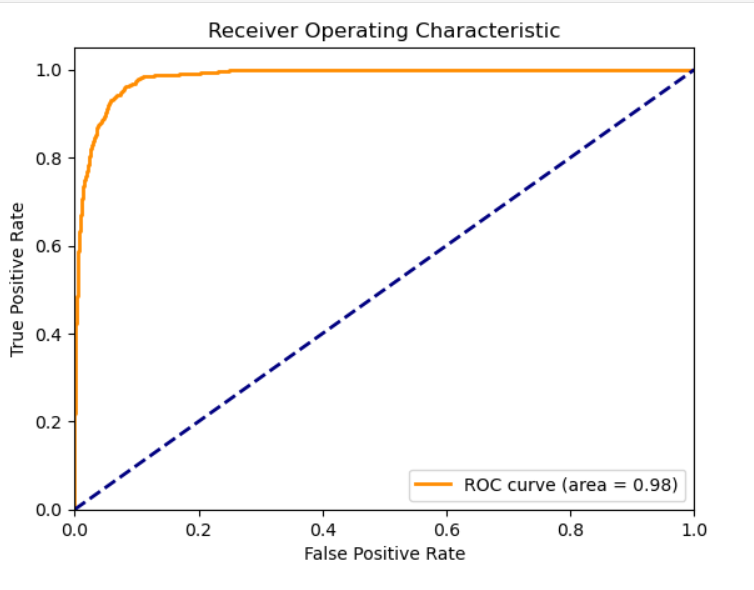

# 📊 Credit Risk Modeling – Loan Default Prediction

> A production-style credit risk model built for Risk Unit usage to measure Probability of Default (PD) and enable risk-based decision making.

---

# 🏦 Objective

To build a machine learning model that a Risk Unit can use to:

- Measure credit risk of loan applicants  
- Estimate Probability of Default (PD)  
- Support data-driven lending decisions  
- Maintain regulatory-compliant model interpretation  

---

# ✅ Success Criteria

The model was validated against the following industry-standard benchmarks:

| Metric | Requirement |
|--------|------------|
| AUC | > 85% |
| Gini Coefficient | > 85% |
| KS Statistic | > 40 |
| Max KS Location | Within First 3 Deciles |
| Interpretability | Mandatory |

✔ All success criteria were achieved.

---

# 📂 Dataset Description

### Data Sources
- Customer Data  
- Loan Data  
- Bureau Data  

### Target Variable
- `1` → Default  
- `0` → Non-Default  

### Data Characteristics
- Mix of numerical and categorical features  
- Includes borrower demographics, loan details, and credit bureau information  

---

# 🔧 Data Preprocessing

### ✔ Data Cleaning
- Replaced invalid values in *Loan Purpose* using mode imputation  
- Ensured domain-consistent corrections  

### ✔ Feature Selection
- Information Value (IV) for predictive strength  
- Variance Inflation Factor (VIF) for multicollinearity  
- Domain knowledge validation  

### ✔ Feature Scaling
- Applied Min-Max Scaling for numerical variables  

---

# 🔀 Train-Test Split

- 75% Training Data  
- 25% Testing Data  
- Stratified split to maintain class distribution  

---

# 🤖 Models Developed

The following models were trained and evaluated:

1. Logistic Regression  
2. XGBoost  
3. Random Forest  

---

# ⚙ Hyperparameter Tuning

Optimization techniques used:

- RandomizedSearchCV  
- Optuna (Bayesian optimization)  
- Cross-validation to ensure stability  

---

# 📈 Model Evaluation Metrics

Model performance was evaluated using:

- ROC-AUC  
- Gini Coefficient  
- KS Statistic  
- Classification Report  
- Confusion Matrix  
- Decile Analysis  

---

# 📊 Model Performance Comparison

| Model | AUC | Gini |
|-------|-----|------|
| Logistic Regression | 98% | 96% |
| XGBoost | 99% | 96% |
| Random Forest | 97% | 95% |

---

# 🏆 Final Model Selected: Logistic Regression

### Why?

Although XGBoost achieved slightly higher AUC, Logistic Regression was selected because:

- Comparable performance  
- Strong interpretability  
- Transparent coefficient explanations  
- Regulatory and compliance friendly  
- Suitable for credit risk scorecard conversion  

---

# 📊 ROC Curve

### Insight
All models show excellent discriminatory power (AUC > 0.97), meaning the model effectively distinguishes defaulters from non-defaulters.

---

# 📊 KS Statistic Analysis

### Insight
- KS Statistic > 40 ✔  
- Maximum KS observed within first 3 deciles ✔  
- Strong separation between cumulative good vs bad distributions  

This confirms effective risk ranking capability.

---

# 📊 Decile Analysis

### Insight
Top deciles contain a significantly higher concentration of defaulters, demonstrating:

- Strong portfolio segmentation  
- Effective prioritization of high-risk customers  

---

# 📊 Feature Importance (Information Value Ranking)

### Insight
Top IV features align with domain expectations and significantly contribute to default prediction.

---

# 💼 Business Impact

This model enables:

✔ Risk-based loan approval strategy  
✔ Early detection of high-risk applicants  
✔ Reduced credit losses  
✔ Portfolio risk segmentation  
✔ Regulatory audit readiness  

Instead of binary approval decisions, the Risk Unit can now:

- Assign probability-based risk scores  
- Set decision thresholds based on risk appetite  
- Monitor portfolio concentration  

---

# 🛠 Tech Stack

- Python  
- Pandas  
- NumPy  
- Scikit-learn  
- XGBoost  
- Optuna  
- Matplotlib  
- Seaborn  

Your Name  
Credit Risk Modeling | Machine Learning | Risk Analytics

